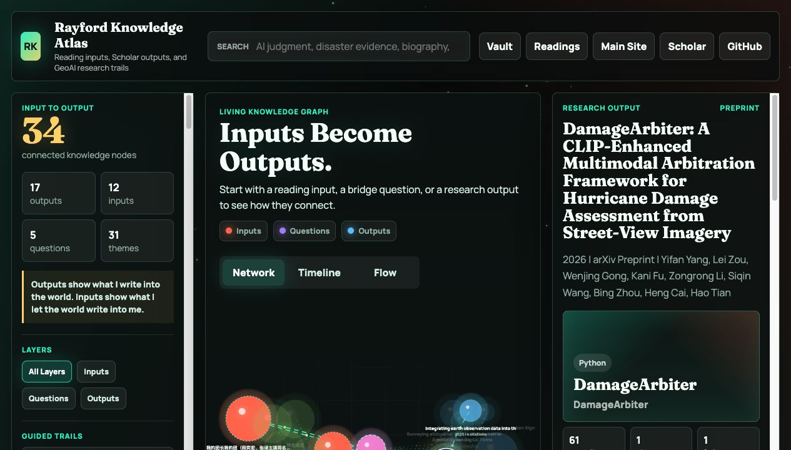

# Rayford Knowledge Atlas

[Open Live Website](https://rayford295.github.io/rayford-knowledge-atlas/) | [Make Your Own](https://rayford295.github.io/rayford-knowledge-atlas/fork.html) | [Google Scholar](https://scholar.google.com/citations?user=B-fiSHwAAAAJ) | [Main Homepage](https://rayford295.github.io/) | [中文说明](./README.zh-CN.md)

Rayford Knowledge Atlas is my public input-output knowledge graph. It places my reading inputs beside my research outputs, so papers, book chapters, collaborative Google Scholar records, repositories, methods, and long-term questions can be inspected in one living system.

The premise is simple: my papers will never outnumber the books, biographies, essays, and technical material that shape my judgment. Research outputs show what I write into the world. Reading inputs show what I let the world write into me.

<p align="center">
  <a href="https://rayford295.github.io/rayford-knowledge-atlas/">
    
  </a>
</p>

## What This Is

- A public knowledge atlas for Yifan Yang's GeoAI, GIScience, reading, and founder-facing thinking.
- An input-output graph where WeRead book nodes feed bridge questions, and bridge questions connect to papers and Scholar outputs.
- A structured markdown wiki that agents and humans can maintain together.
- A weekly-updated Google Scholar snapshot that includes collaborative and non-first-author outputs.
- A consolidated publication layer migrated from the former `rayford295/Publications` repository.
- A public-safe reading layer that stores metadata, themes, and synthesis scaffolds without publishing raw copyrighted highlights or private notes.
- An Obsidian-ready vault with maps of content, wiki links, templates, and graph color groups.

## One-Click Access

- Live site: [rayford295.github.io/rayford-knowledge-atlas](https://rayford295.github.io/rayford-knowledge-atlas/)
- Fork guide: [rayford295.github.io/rayford-knowledge-atlas/fork.html](https://rayford295.github.io/rayford-knowledge-atlas/fork.html)
- GitHub repository: [github.com/rayford295/rayford-knowledge-atlas](https://github.com/rayford295/rayford-knowledge-atlas)
- Google Scholar: [scholar.google.com/citations?user=B-fiSHwAAAAJ](https://scholar.google.com/citations?user=B-fiSHwAAAAJ)
- Main academic homepage: [rayford295.github.io](https://rayford295.github.io/)

## Frontend Experience

- The first screen is an interactive knowledge constellation.
- The graph supports keyword search, theme filters, node cards, and three views: `Network`, `Timeline`, and `Flow`.
- `Flow` separates reading inputs, bridge questions, and research outputs.
- Each node opens an inspector with source metadata, themes, methods or reading lenses, links, metrics, and graph relationships.
- Scholar-derived nodes keep collaborative outputs visible even when they do not yet have hand-written wiki pages.

## Knowledge Architecture

- `wiki/papers/`: curated research output profiles.
- `wiki/readings/`: public-safe WeRead reading input pages.
- `wiki/questions/`: bridge questions that connect reading to research.
- `wiki/maps/`: Obsidian-style maps of content for navigating the vault.
- `wiki/templates/`: starter templates for new reading and question notes.
- `.obsidian/`: minimal vault settings for opening this repository in Obsidian.
- `wiki/concepts/`: reusable concept pages.
- `wiki/comparisons/`: cross-paper and cross-source narratives.
- `raw/papers/`: source records for paper and repository metadata.
- `raw/publications/`: migrated publication records from the former Publications repository.
- `raw/scholar/google-scholar.json`: the latest public Google Scholar snapshot.
- `raw/weread/public-reading-index.json`: public-safe WeRead metadata, note counts, and reading graph seeds.
- `scripts/build-map.js`: compiles papers, readings, questions, and Scholar records into `data.js`.
- `scripts/fetch-scholar.js`: refreshes public Google Scholar metadata.
- `scripts/fetch-weread.js`: refreshes public-safe WeRead reading nodes from `WEREAD_API_KEY`.
- `docs/ATLAS_ARCHITECTURE.md`: explains the input-question-output graph model.
- `docs/OPERATIONS.md`: gives the update, QA, and publishing runbook.
- `docs/OBSIDIAN_VAULT.md`: explains how to use the repository as an Obsidian vault.
- `docs/PUBLICATIONS_MIGRATION.md`: records the Publications repository consolidation.

## Current Output Layer

- Curated paper/project nodes: Agentic Urban Digital Twins, ArcGIS Text SAM, GeoLocator, Hyperlocal Disaster Damage Assessment, DisasterVLP, DamageArbiter, Satellite-to-Street, and the migrated Publications records.
- Google Scholar nodes: collaborative and non-first-author outputs from the public Scholar profile.

## Current Input Layer

The first WeRead seed imports the highest-signal public-safe reading nodes by note count, including books on institutions, biography, AI futures, founder judgment, public voice, and social imagination. Raw highlights and private note text are intentionally excluded from the public repository.

## Local Workflow

```bash
npm run scholar:update
npm run weread:update
npm run build
```

Use `npm run build` after editing `wiki/papers/`, `wiki/readings/`, or `wiki/questions/`. Use `npm run weread:update` only in a local environment where `WEREAD_API_KEY` is configured.

## Privacy and Copyright Boundary

This repository is public. The reading layer therefore commits only metadata, counts, themes, and Yifan's own synthesis scaffolds. It does not publish raw WeRead highlights, private thoughts, or long copyrighted excerpts.

## Maintenance Docs

- [Atlas Architecture](./docs/ATLAS_ARCHITECTURE.md)
- [Operations Runbook](./docs/OPERATIONS.md)
- [WeRead Integration](./docs/WEREAD_INTEGRATION.md)
- [Obsidian Vault Guide](./docs/OBSIDIAN_VAULT.md)
- [Hermes Review](./docs/HERMES_REVIEW.md)
- [Publications Migration](./docs/PUBLICATIONS_MIGRATION.md)

## Make Your Own

This repository can still be forked as a template. Start with the [Make Your Own page](https://rayford295.github.io/rayford-knowledge-atlas/fork.html), then follow [docs/FORK_GUIDE.md](./docs/FORK_GUIDE.md).
