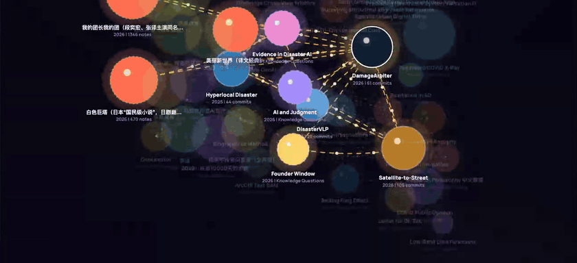

# Rayford Knowledge Atlas

<p align="center">
  <a href="https://rayford295.github.io/rayford-knowledge-atlas/"></a>
  <a href="https://github.com/rayford295/rayford-knowledge-atlas/commits/main"></a>
  <a href="./LICENSE"></a>
  <a href="./LICENSE-CONTENT.md"></a>
  <a href="https://scholar.google.com/citations?user=B-fiSHwAAAAJ"></a>
</p>

[Open Live Website](https://rayford295.github.io/rayford-knowledge-atlas/) | [Make Your Own](https://rayford295.github.io/rayford-knowledge-atlas/fork.html) | [Google Scholar](https://scholar.google.com/citations?user=B-fiSHwAAAAJ) | [Main Homepage](https://rayford295.github.io/) | [中文说明](./README.zh-CN.md)

Rayford Knowledge Atlas is my public input-output knowledge graph. It places my reading inputs beside my research outputs and public writing, so papers, book chapters, collaborative Google Scholar records, repositories, methods, long-term questions, research philosophy, and mentorship writing can be inspected in one living system.

The premise is simple: my papers will never outnumber the books, biographies, essays, and technical material that shape my judgment. Research outputs show what I write into the world. Reading inputs show what I let the world write into me.

<p align="center">
  <a href="https://rayford295.github.io/rayford-knowledge-atlas/">
    
  </a>
</p>

## What This Is

- A public knowledge atlas for Yifan Yang's GeoAI, GIScience, reading, and founder-facing thinking.
- An input-output graph where WeRead book nodes feed bridge questions, and bridge questions connect to papers and Scholar outputs.
- A structured markdown wiki that agents and humans can maintain together.
- A weekly-updated Google Scholar snapshot that includes collaborative and non-first-author outputs.
- A consolidated publication layer migrated from the former `rayford295/Publications` repository.
- A public writing layer for research philosophy, reflective essays, and mentorship writing that should remain visible beside formal papers.
- A public-safe reading layer that stores metadata, themes, and synthesis scaffolds without publishing raw copyrighted highlights or private notes.
- An Obsidian-ready vault with maps of content, wiki links, templates, and graph color groups.

## One-Click Access

| Page | What it is | Link |
|---|---|---|
| 🌌 Atlas | Interactive knowledge constellation (home) | [Open](https://rayford295.github.io/rayford-knowledge-atlas/) |
| 📚 Readings | WeRead reading inputs, made public-safe | [Open](https://rayford295.github.io/rayford-knowledge-atlas/readings.html) |
| 🧭 Advisor | Shelf-vs-notes reading intelligence | [Open](https://rayford295.github.io/rayford-knowledge-atlas/advisor.html) |
| 📄 Papers | Research output library | [Open](https://rayford295.github.io/rayford-knowledge-atlas/papers.html) |
| 🗺️ Rooms | Maps, concepts, and comparison rooms | [Open](https://rayford295.github.io/rayford-knowledge-atlas/rooms.html) |
| 🌍 Travel Map | 3D globe of visited places | [Open](https://rayford295.github.io/rayford-knowledge-atlas/map/) |
| 🍴 Fork Guide | Make your own atlas | [Open](https://rayford295.github.io/rayford-knowledge-atlas/fork.html) |

| Archive | Contents | Link |
|---|---|---|
| Public writing | Research philosophy, reflection, mentorship | [Browse](https://github.com/rayford295/rayford-knowledge-atlas/tree/main/wiki/public-writing) |
| Publications | Published PDFs, filenames start with year | [Browse](https://github.com/rayford295/rayford-knowledge-atlas/tree/main/publications) |
| Ph.D. journey | Doctoral milestones and reflections | [Browse](https://github.com/rayford295/rayford-knowledge-atlas/tree/main/phd-journey) |
| Profiles | [Google Scholar](https://scholar.google.com/citations?user=B-fiSHwAAAAJ) · [Main homepage](https://rayford295.github.io/) | — |

## Frontend Experience

- The first screen is an interactive knowledge constellation.
- Reading inputs, reading intelligence, and research outputs have separate library pages, so the main atlas can focus on relationships instead of acting as one crowded catalog.
- The reading advisor page applies the huashu-weread method: cross the shelf with notebooks, separate intention from deep reading, and turn reading signals into workflows.
- The graph supports keyword search, theme filters, node cards, and three views: `Network`, `Timeline`, and `Flow`.
- `Flow` separates reading inputs, bridge questions, and research outputs.
- Each node opens an inspector with source metadata, themes, methods or reading lenses, links, metrics, and graph relationships.
- Scholar-derived nodes keep collaborative outputs visible even when they do not yet have hand-written wiki pages.

## Travel Map

An interactive 3D globe lights up every place I have visited — **17 of 50 U.S. states, 26 cities, and 2 countries** (United States and Canada). Drag to rotate, scroll to zoom, and hover a glowing point to read the city.

<p align="center">
  <a href="https://rayford295.github.io/rayford-knowledge-atlas/map/">
    
  </a>
</p>

<p align="center">
  <a href="https://rayford295.github.io/rayford-knowledge-atlas/map/"><b>Open the interactive globe →</b></a>
</p>

## Knowledge Architecture

```text
rayford-knowledge-atlas/
├── wiki/                     # agent-maintained markdown knowledge base
│   ├── papers/               #   curated research output profiles
│   ├── readings/             #   public-safe WeRead reading input pages
│   ├── questions/            #   bridge questions connecting inputs → outputs
│   ├── public-writing/       #   research philosophy, reflection, mentorship
│   ├── concepts/             #   reusable concept pages
│   ├── comparisons/          #   cross-paper and cross-source narratives
│   ├── maps/                 #   Obsidian-style maps of content
│   └── templates/            #   starter templates for new notes
├── publications/             # published PDFs, filenames start with year
├── phd-journey/              # doctoral milestones and reflections
├── raw/                      # immutable source records
│   ├── papers/               #   paper and repository metadata
│   ├── public-writing/       #   mirrored public-writing backups
│   ├── publications/         #   migrated Publications repo records
│   ├── scholar/              #   google-scholar.json (weekly snapshot)
│   └── weread/               #   public-safe reading metadata + advisor signals
├── scripts/                  # build-map.js · fetch-scholar.js · fetch-weread.js
├── docs/                     # architecture · operations · vault + fork guides
├── .obsidian/                # minimal vault settings for Obsidian
└── index.html + *.html       # the live atlas site (GitHub Pages)
```

- `scripts/build-map.js` compiles `wiki/papers/`, `wiki/readings/`, `wiki/questions/`, public writing, and the Scholar snapshot into `data.js`.
- `scripts/fetch-scholar.js` refreshes public Google Scholar metadata; `scripts/fetch-weread.js` refreshes public-safe WeRead nodes from `WEREAD_API_KEY`.
- `docs/ATLAS_ARCHITECTURE.md` explains the input-question-output graph model; `docs/OPERATIONS.md` is the update, QA, and publishing runbook.

## Current Output Layer

- Curated paper/project nodes: Agentic Urban Digital Twins, ArcGIS Text SAM, GeoLocator, Hyperlocal Disaster Damage Assessment, DisasterVLP, DamageArbiter, Satellite-to-Street, and the migrated Publications records.
- Public writing nodes: Research Philosophy, Research Philosophy Summary (中文整理), and the letter supporting Professor Lei Zou's teaching award nomination.
- Google Scholar nodes: collaborative and non-first-author outputs from the public Scholar profile.

## Current Input Layer

The WeRead layer imports the highest-signal public-safe reading nodes by note count, including books on institutions, biography, AI futures, founder judgment, public voice, and social imagination. The advisor layer then compares shelf presence with notebook evidence to identify deep reads, recent signals, shelf gaps, and reading-to-output workflow moves. Raw highlights and private note text are intentionally excluded from the public repository.

## Local Workflow

```bash
npm run scholar:update
npm run weread:update
npm run public-writing:sync
npm run build
```

Use `npm run build` after editing `wiki/papers/`, `wiki/public-writing/`, `wiki/readings/`, or `wiki/questions/`. Use `npm run public-writing:sync` when the source `awesome-autonomous-geoai` philosophy files change. Use `npm run weread:update` only in a local environment where `WEREAD_API_KEY` is configured.

The public-writing mirror also refreshes weekly through `.github/workflows/update-public-writing.yml`.

## Privacy and Copyright Boundary

This repository is public. The reading layer therefore commits only metadata, counts, themes, and Yifan's own synthesis scaffolds. It does not publish raw WeRead highlights, private thoughts, or long copyrighted excerpts.

## Maintenance Docs

- [Atlas Architecture](./docs/ATLAS_ARCHITECTURE.md)
- [Operations Runbook](./docs/OPERATIONS.md)
- [WeRead Integration](./docs/WEREAD_INTEGRATION.md)
- [Obsidian Vault Guide](./docs/OBSIDIAN_VAULT.md)
- [Hermes Review](./docs/HERMES_REVIEW.md)
- [Publications Migration](./docs/PUBLICATIONS_MIGRATION.md)

## Make Your Own

This repository can still be forked as a template. Start with the [Make Your Own page](https://rayford295.github.io/rayford-knowledge-atlas/fork.html), then follow [docs/FORK_GUIDE.md](./docs/FORK_GUIDE.md).

## License

This project is dual-licensed:

- **Software** (build scripts, site code, configuration) — [MIT License](./LICENSE).
- **Content** (`wiki/`, `publications/`, `raw/`, `assets/`, and the prose in this README and `docs/`) — [Creative Commons Attribution 4.0 International (CC BY 4.0)](./LICENSE-CONTENT.md).

You are free to fork the code and adapt the content, provided you keep the MIT notice for the code and give attribution for the content. Published PDFs may remain under their original publishers' terms.
