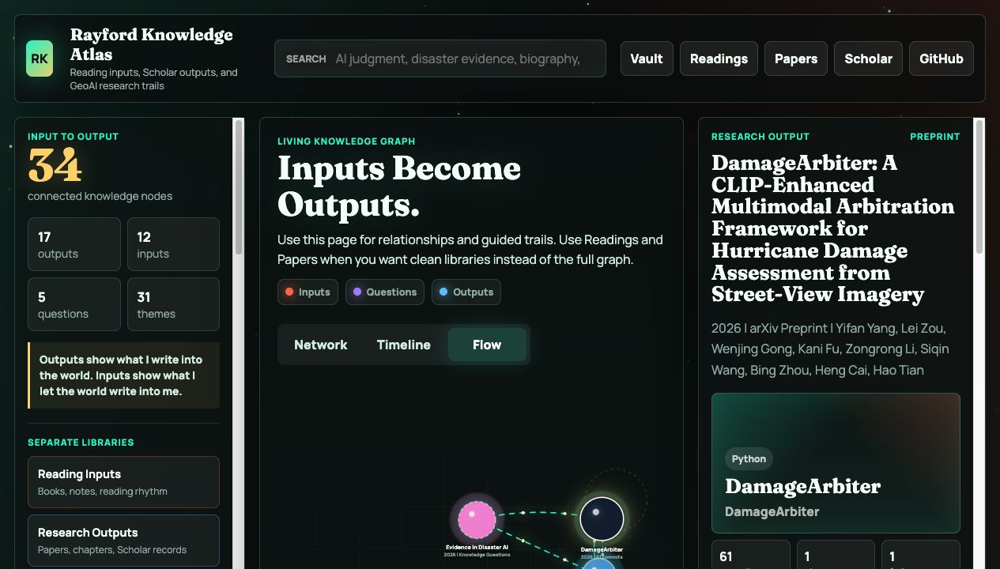

# Rayford Knowledge Atlas

<p align="center">
  <a href="https://rayford295.github.io/rayford-knowledge-atlas/"></a>
  <a href="https://github.com/rayford295/rayford-knowledge-atlas/commits/main"></a>
  <a href="./LICENSE"></a>
  <a href="./LICENSE-CONTENT.md"></a>
  <a href="https://scholar.google.com/citations?user=B-fiSHwAAAAJ"></a>
</p>

[一键打开网站](https://rayford295.github.io/rayford-knowledge-atlas/) | [做一个自己的版本](https://rayford295.github.io/rayford-knowledge-atlas/fork.html) | [Google Scholar](https://scholar.google.com/citations?user=B-fiSHwAAAAJ) | [打开学术主页](https://rayford295.github.io/) | [English README](./README.md)

Rayford Knowledge Atlas 是我的公开“输入-输出”知识图谱。它把我的阅读输入、研究输出和公共写作放在同一个系统里，让论文、书章、合作论文、Google Scholar 记录、GitHub 仓库、方法、概念、长期问题、研究哲学和师生情谊写作可以互相连接。

这个仓库的核心判断很简单：我的论文数量不可能比我读过的书更多。论文是我写向世界的输出，阅读是世界写进我判断力的输入。

<p align="center">
  <a href="https://rayford295.github.io/rayford-knowledge-atlas/">
    
  </a>
</p>

## 这是什么

- 一个面向公众开放的 GeoAI、GIScience、阅读和创业思考知识图谱。
- 一个输入-输出图谱：微信读书里的书籍节点连接到长期问题，长期问题再连接到论文和 Scholar 输出。
- 一个由 markdown 维护的结构化知识库，适合人和 agent 一起持续更新。
- 一个每周自动更新的 Google Scholar 公开快照，其中包含合作论文和非一作论文。
- 一个已经合并 `rayford295/Publications` 旧仓库的 publication 输出层。
- 一个公共写作层：保存研究哲学、反思文章和应该与正式论文放在一起被看见的师生情谊材料。
- 一个公开安全的阅读层：只保存书名、作者、笔记数量、主题和个人综合框架，不公开原始划线和私密想法。
- 一个可以直接用 Obsidian 打开的 vault，包含 MOC、wiki links、模板和 graph color groups。

## 一键入口

| 页面 | 内容 | 链接 |
|---|---|---|
| 🌌 Atlas | 交互式知识星图（首页） | [打开](https://rayford295.github.io/rayford-knowledge-atlas/) |
| 📚 Readings | 公开安全的微信读书阅读输入 | [打开](https://rayford295.github.io/rayford-knowledge-atlas/readings.html) |
| 🧭 Advisor | 书架 vs 笔记的阅读智能分析 | [打开](https://rayford295.github.io/rayford-knowledge-atlas/advisor.html) |
| 📄 Papers | 研究输出库 | [打开](https://rayford295.github.io/rayford-knowledge-atlas/papers.html) |
| 🗺️ Rooms | 地图、概念与对比房间 | [打开](https://rayford295.github.io/rayford-knowledge-atlas/rooms.html) |
| 🌍 旅行地图 | 到访地点的 3D 地球仪 | [打开](https://rayford295.github.io/rayford-knowledge-atlas/map/) |
| 🍴 Fork 指南 | 做一个自己的 atlas | [打开](https://rayford295.github.io/rayford-knowledge-atlas/fork.html) |

| 归档 | 内容 | 链接 |
|---|---|---|
| 公共写作 | 研究哲学、反思、师生情谊写作 | [浏览](https://github.com/rayford295/rayford-knowledge-atlas/tree/main/wiki/public-writing) |
| 已发表论文 | 公开 PDF，文件名以年份开头 | [浏览](https://github.com/rayford295/rayford-knowledge-atlas/tree/main/publications) |
| 博士旅程 | 里程碑、考核文件与反思 | [浏览](https://github.com/rayford295/rayford-knowledge-atlas/tree/main/phd-journey) |
| 个人主页 | [Google Scholar](https://scholar.google.com/citations?user=B-fiSHwAAAAJ) · [学术主页](https://rayford295.github.io/) | — |

## 前端体验

- 第一屏就是交互式知识星图。
- 阅读输入、阅读顾问和论文输出现在有各自独立页面，首页主要承担关系总览，而不是把所有节点挤在同一个目录里。
- 阅读顾问页使用 huashu-weread 的方法：把书架和笔记交叉分析，区分“想读”“真读”“隐藏深读”和“最近活跃”。
- 支持关键词搜索、主题筛选、节点卡片，以及 `Network`、`Timeline`、`Flow` 三种视图。
- `Flow` 视图把阅读输入、桥接问题和研究输出分开摆放。
- 点击节点后，右侧 inspector 会展示来源、主题、方法或阅读视角、链接、指标和图谱关系。
- Scholar 自动节点让合作论文和非一作论文也能进入输出层，而不是只展示手工写过的项目页。

## 旅行地图

一个交互式 3D 地球仪点亮了我去过的每一个地方——**美国 50 个州中的 17 个、26 座城市、2 个国家**（美国和加拿大）。拖动旋转、滚轮缩放，悬停发光的点即可查看城市名。

<p align="center">
  <a href="https://rayford295.github.io/rayford-knowledge-atlas/map/">
    
  </a>
</p>

<p align="center">
  <a href="https://rayford295.github.io/rayford-knowledge-atlas/map/"><b>打开交互式地球仪 →</b></a>
</p>

## 知识库结构

```text
rayford-knowledge-atlas/
├── wiki/                     # agent 与人共同维护的 markdown 知识库
│   ├── papers/               #   精修过的研究输出页面
│   ├── readings/             #   公开安全的微信读书阅读输入页面
│   ├── questions/            #   连接阅读与论文的长期问题
│   ├── public-writing/       #   研究哲学、反思、师生情谊写作
│   ├── concepts/             #   可复用概念页面
│   ├── comparisons/          #   跨论文、跨来源的综合叙事
│   ├── maps/                 #   Obsidian 风格的 Maps of Content
│   └── templates/            #   新笔记模板
├── publications/             # 已发表论文 PDF，文件名以年份开头
├── phd-journey/              # 博士里程碑、考核文件与反思
├── raw/                      # 不可变的原始记录
│   ├── papers/               #   论文与仓库元数据
│   ├── public-writing/       #   公共写作完整备份
│   ├── publications/         #   旧 Publications 仓库迁移记录
│   ├── scholar/              #   google-scholar.json（每周快照）
│   └── weread/               #   公开安全的阅读元数据与顾问信号
├── scripts/                  # build-map.js · fetch-scholar.js · fetch-weread.js
├── docs/                     # 架构 · 运维 · vault 与 fork 指南
├── .obsidian/                # Obsidian vault 最小配置
└── index.html + *.html       # 线上站点（GitHub Pages）
```

- `scripts/build-map.js` 把 `wiki/papers/`、`wiki/readings/`、`wiki/questions/`、公共写作和 Scholar 快照编译成 `data.js`。
- `scripts/fetch-scholar.js` 刷新 Google Scholar 公开指标；`scripts/fetch-weread.js` 通过 `WEREAD_API_KEY` 刷新公开安全的阅读节点。
- `docs/ATLAS_ARCHITECTURE.md` 解释输入-问题-输出的图谱模型；`docs/OPERATIONS.md` 是更新、检查和发布的操作手册。

## 当前输出层

- 手工精修的论文/项目节点：Agentic Urban Digital Twins、ArcGIS Text SAM、GeoLocator、Hyperlocal Disaster Damage Assessment、DisasterVLP、DamageArbiter、Satellite-to-Street，以及从 Publications 迁移出的论文记录。
- 公共写作节点：Research Philosophy、Research Philosophy Summary (中文整理)，以及支持 Professor Lei Zou 教学奖提名的推荐信。
- Google Scholar 节点：来自公开 Scholar profile 的合作论文和非一作论文。

## 当前输入层

微信读书层导入了笔记量最高的一批公开安全阅读节点，覆盖组织压力、人物传记、AI 未来、创业判断、公共表达和社会想象等主题。阅读顾问层会继续比较书架和笔记证据，识别深读、最近活跃、书架缺口，以及可以转成输出的 workflow。原始划线和私密想法不会进入公开仓库。

## 本地更新流程

```bash
npm run scholar:update
npm run weread:update
npm run public-writing:sync
npm run build
```

修改 `wiki/papers/`、`wiki/public-writing/`、`wiki/readings/` 或 `wiki/questions/` 后运行 `npm run build`。当源仓库 `awesome-autonomous-geoai` 里的 research philosophy 文件变化时，运行 `npm run public-writing:sync` 刷新 atlas 备份。只有在本地已经配置 `WEREAD_API_KEY` 时才运行 `npm run weread:update`。

公共写作镜像也会通过 `.github/workflows/update-public-writing.yml` 每周自动刷新一次。

## 隐私和版权边界

这个仓库是公开的。因此阅读层只提交元数据、数量、主题和我自己的综合框架，不提交微信读书原始划线、私密想法或长篇版权摘录。

## 维护文档

- [Atlas Architecture](./docs/ATLAS_ARCHITECTURE.md)
- [Operations Runbook](./docs/OPERATIONS.md)
- [WeRead Integration](./docs/WEREAD_INTEGRATION.md)
- [Obsidian Vault Guide](./docs/OBSIDIAN_VAULT.md)
- [Hermes 评审与优化建议](./docs/HERMES_REVIEW.zh-CN.md)
- [Publications Migration](./docs/PUBLICATIONS_MIGRATION.md)

## 做一个自己的版本

这个仓库仍然可以作为模板 fork。先打开 [Make Your Own 页面](https://rayford295.github.io/rayford-knowledge-atlas/fork.html)，再看 [docs/FORK_GUIDE.md](./docs/FORK_GUIDE.md)。

## 许可证

本项目采用双许可证：

- **代码**（构建脚本、站点代码、配置）——[MIT 许可证](./LICENSE)。
- **内容**（`wiki/`、`publications/`、`raw/`、`assets/`，以及本 README 和 `docs/` 中的文字）——[知识共享署名 4.0 国际许可证（CC BY 4.0）](./LICENSE-CONTENT.md)。

你可以自由 fork 代码、改编内容，前提是保留代码的 MIT 声明、并对内容进行署名。已发表的 PDF 可能仍受其原出版方条款约束。
