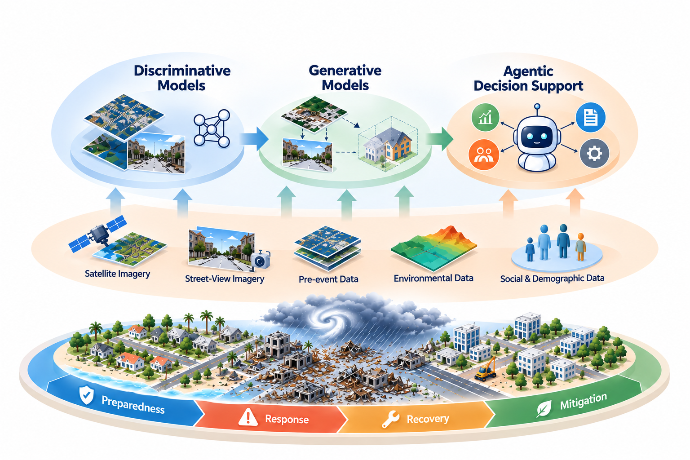

# Dissertation Proposal

This folder records my dissertation proposal: working drafts as they are revised with my committee, and, after the defense, the final document, the defense slides, and reflections.

**Proposal defense:** Thursday, October 22, 2026, 1:00–2:30 p.m. CDT, Room 807, Eller O&M Building ([flyer](./2026-10-22-proposal-defense-flyer.pdf))
**Program:** Ph.D., Geography, Texas A&M University
**Advisor:** Dr. Lei Zou

## Dissertation

**Advancing GeoAI for Disaster Resilience: From Damage Assessment to Responsible Decision Support**

The three-stage structure below is unchanged; the title was shortened on my advisor’s advice before the proposal went to the committee (the working-draft title was *Evolving GeoAI for Disaster Resilience: From Discriminative Damage Assessment to Generative Multi-View Understanding and Agentic Decision Support*).

The framing has evolved since the [preliminary examination](../preliminary-examination/), from a four-layer *system* to a three-stage *evolution* of GeoAI itself, each stage building on the data, models, and lessons of the previous one:

- **Stage 1, discriminative damage assessment:** a single hurricane seen from a single, incomplete ground-level view (Cases 1–2).
- **Stage 2, generative multi-view understanding:** many views, regions, and hazard types without event-specific training (Cases 3–5).
- **Stage 3, agentic decision support:** anticipating, inspecting, and communicating place-based impacts with an accountable GeoAI agent, RAY (Cases 6–7).

## Defense

- [Proposal defense flyer (PDF)](./2026-10-22-proposal-defense-flyer.pdf): October 22, 2026, 1:00–2:30 p.m. CDT, Room 807, Eller O&M Building; committee Dr. Lei Zou (Chair), Dr. Heng Cai, Dr. Andrew Klein, Dr. Zhengzhong Tu.

## Drafts

| Date | Version | Files |
| --- | --- | --- |
| 2026-09-30 | Committee version (sent to committee after advisor review; not yet defended) | [PDF](./2026-09-30-yifan-yang-dissertation-proposal-committee-version.pdf) · [DOCX](./2026-09-30-yifan-yang-dissertation-proposal-committee-version.docx) |
| 2026-09-30 | Working draft (superseded by the committee version) | [PDF](./2026-09-30-yifan-yang-dissertation-proposal-draft.pdf) · [DOCX](./2026-09-30-yifan-yang-dissertation-proposal-draft.docx) · [Framework figure](./2026-09-30-conceptual-framework.png) |

## After the defense

- Final proposal document (PDF), if revised after the defense
- Proposal defense slides (PDF)
- Reflections: what changed between the preliminary examination and the proposal, and why
