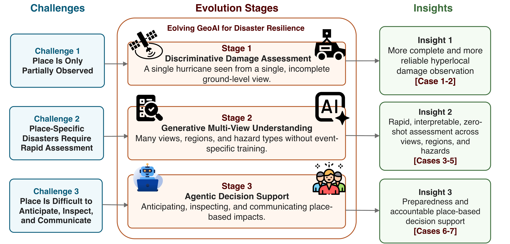

# Preliminary Examination (Written) — Research Reflections

This folder records the substance of my written preliminary examination: the research philosophy, key concepts, and reflections I articulated during the process. For confidentiality, the examination questions themselves are not reproduced here. What follows is my own thinking, written as standalone notes, so that the ideas can live in this atlas without exposing the exam.

**Date:** June 2026
**Program:** Ph.D., Geography, Texas A&M University
**Advisor:** Dr. Lei Zou

## Oral Presentation Slides

- [Yifan Yang Ph.D. Preliminary Examination Slides](./2026-06-24-yifan-yang-phd-prelim-slides.pdf)

## Dissertation

**Cross-View Geospatial Artificial Intelligence for Disaster Damage Assessment: From Ground-Level Perception to Immersive Decision Support** (title at the time of the preliminary examination; see the proposal draft below for how the framing has since evolved).

Two keywords anchor the whole program: **disaster resilience** and **GeoAI**. The dissertation is organized as a four-layer system, and the through-theme is *responsibility*: beyond accuracy, the work should be interpretable, fair, and trustworthy.

## The four-layer framework

1. **Observation** — pre- and post-disaster street view, satellite imagery, generated imagery, and planned 3D scenes.
2. **Reasoning** — ViT, CLIP, the disagreement-driven arbitrator, the multi-agent RAPID pipeline, and cross-view generation.
3. **Evaluation and governance** — uncertainty measurement, overconfidence analysis, conflict-aware evaluation, audit trails, and human-in-the-loop review.
4. **Delivery and feedback** — damage maps, interpretable reports, and a planned immersive 3D representation with user feedback.

When I say "system," I mean this end-to-end framework as a whole, including governance and delivery, not only the part that makes predictions.

## From the preliminary examination to the dissertation proposal

The examination is the point where the program was first articulated as a single arc. Since then the framing has evolved from a four-layer *system* into a three-stage *evolution* of GeoAI itself, and the title has changed to:

**Evolving GeoAI for Disaster Resilience: From Discriminative Damage Assessment to Generative Multi-View Understanding and Agentic Decision Support**

- Stage 1, discriminative damage assessment: a single hurricane seen from a single, incomplete ground-level view (Cases 1–2).
- Stage 2, generative multi-view understanding: many views, regions, and hazard types without event-specific training (Cases 3–5).
- Stage 3, agentic decision support: anticipating, inspecting, and communicating place-based impacts with an accountable GeoAI agent (Cases 6–7).

Working draft of the proposal (not the defended version; the final document will live in [`../dissertation-proposal/`](../dissertation-proposal/) after the defense):

- [Dissertation proposal draft, 2026-09-30 (PDF)](./2026-09-30-yifan-yang-dissertation-proposal-draft.pdf) · [DOCX](./2026-09-30-yifan-yang-dissertation-proposal-draft.docx)
- [Conceptual framework figure](./2026-09-30-conceptual-framework.png)

## Notes in this folder

| # | Note | Theme |
| --- | --- | --- |
| 01 | [Research Philosophy](./01-research-philosophy.md) | The responsible cross-view GeoAI program and its arc |
| 02 | [Key Concepts](./02-key-concepts.md) | Autonomy, automation, self-evolution; interpretability, fairness, trustworthiness; mutual visibility; high-stakes applications |
| 03 | [Core Contribution](./03-core-contribution.md) | The single scientific contribution the dissertation makes |
| 04 | [Generative AI and the Response Phase](./04-generative-ai-and-the-response-phase.md) | Where my work sits in the disaster-resilience lifecycle |
| 05 | [Scholarly Influences](./05-scholarly-influences.md) | External researchers whose work informs mine |
| 06 | [Future Direction: Immersive Delivery](./06-future-direction.md) | The next study and the reading behind it |

> "Seeing, describing, and governing disasters: beyond the boundaries of the screen, let the real world become the stage for intelligence."
